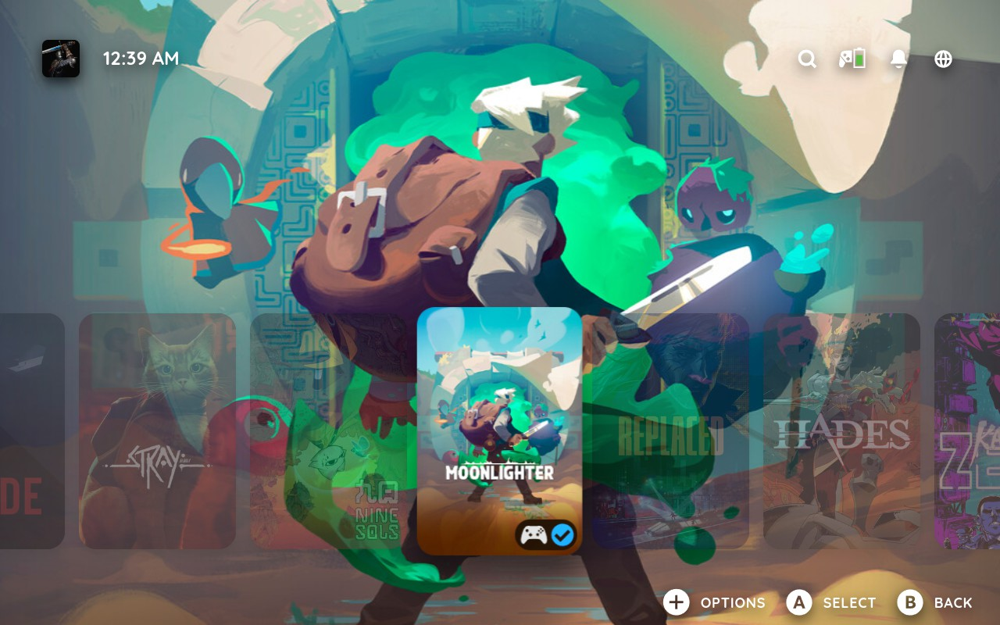
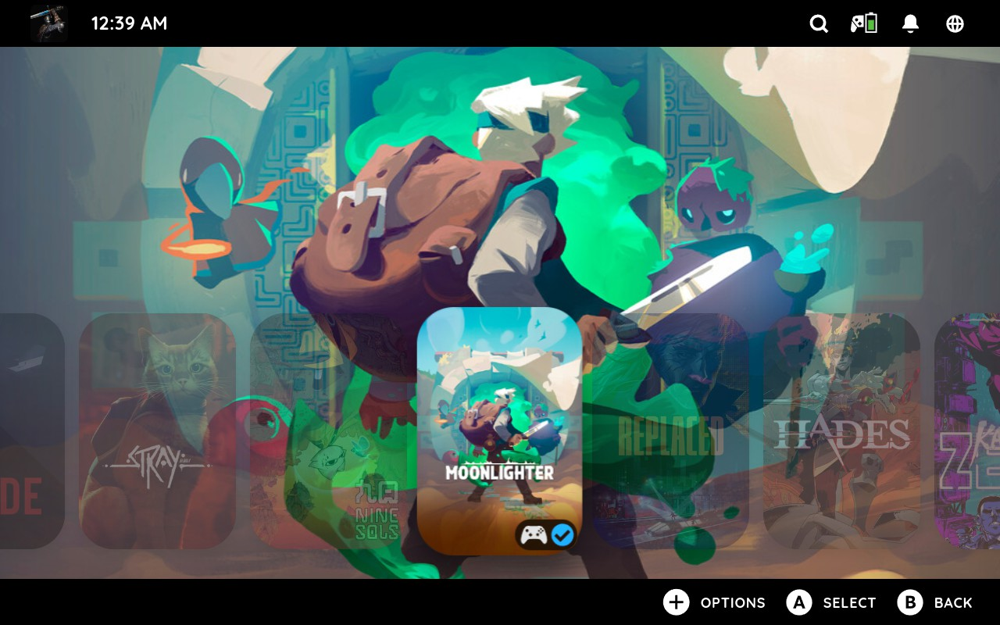
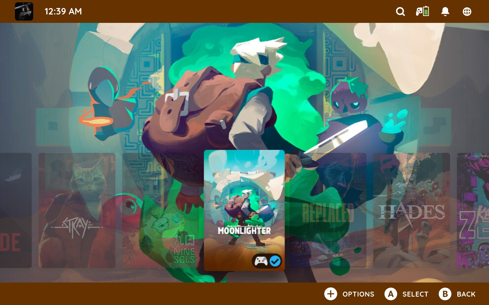
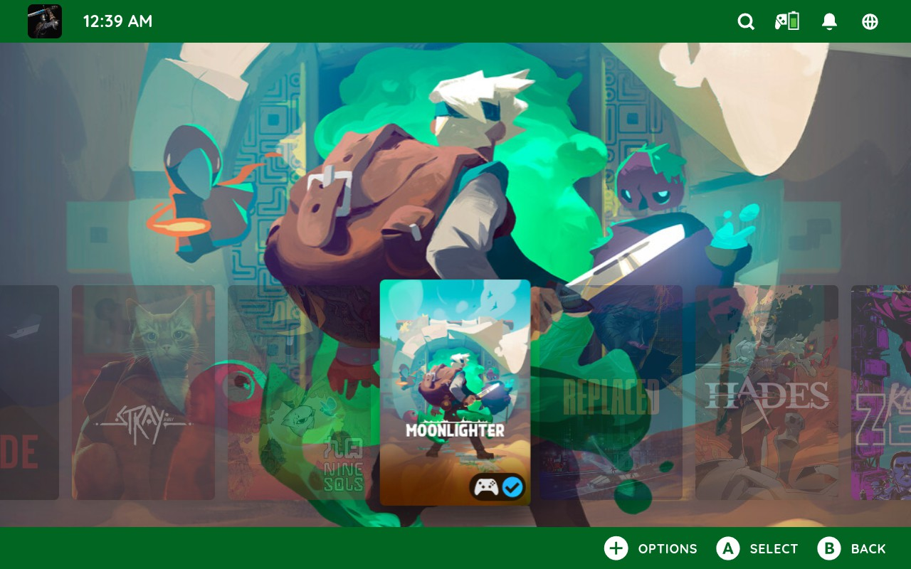
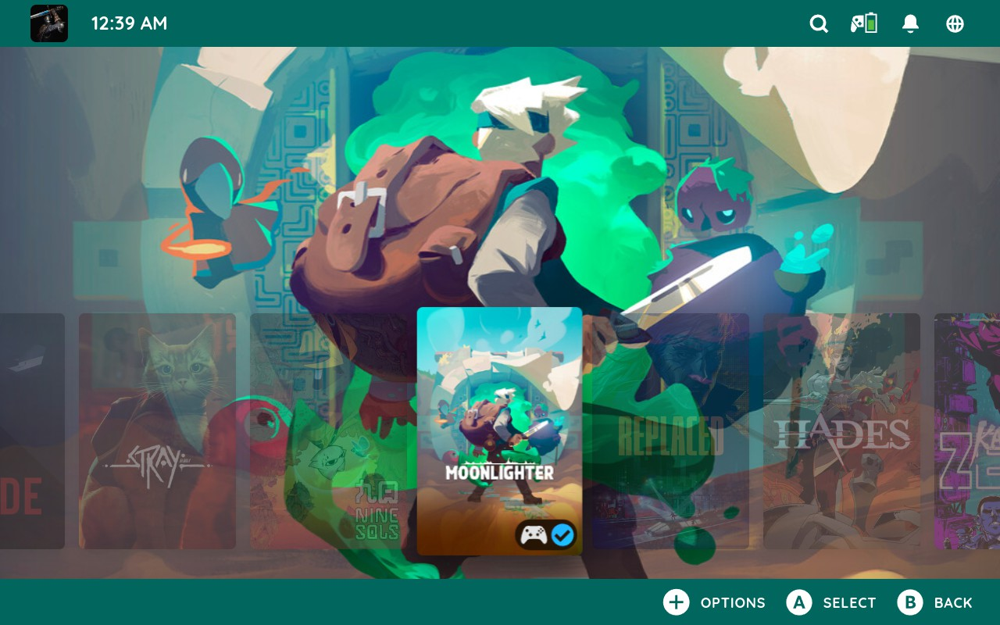
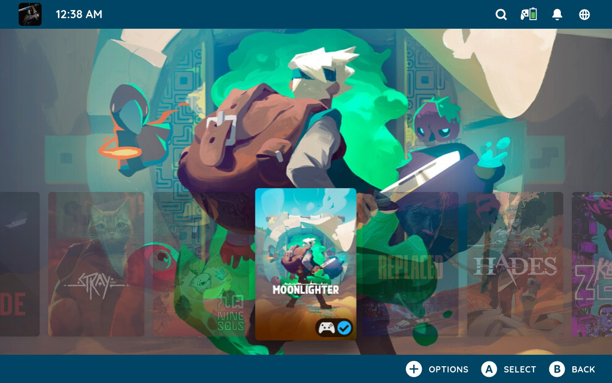
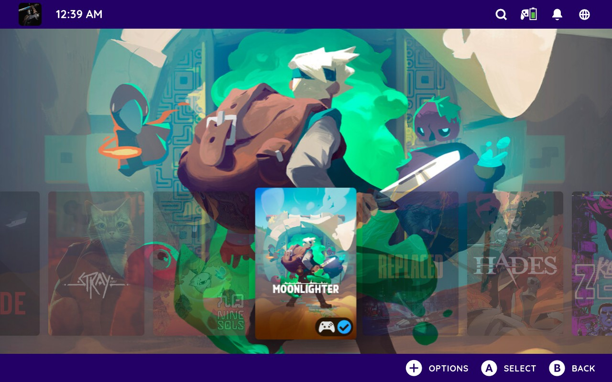

# Machine Ready TV

## Description

Custom CSS Loader themes designed to deliver a more console-like Steam Big Picture experience, including customized versions of:
- Clean Game launch
- Clean Gameview
- Colored Toggles
- Round

Full credit for the original themes above goes to Niko, SuchMeme and EMERALD#0874.

**Thank you for making this project possible!**

## Installation

1. Click **Code** → **Download ZIP**.
2. Extract the archive and copy all themes from the included folder.
3. Paste them into `home/homebrew/themes` (alongside your existing themes).

### Optional

4. Open the CSS Loader Theme Store and install the following themes:
   - Avatar Customization Suite
   - Better Blur
   - Clean Library Capsule
   - Focus Highlight Color
   - Game Cover Shine Animation Color
   - Hero Zoom Eradication
   - Main Menu Hide Tabs (Hide the Store)
   - No Hero Gradient
   - No Home Game Glow
   - No Home Tabs
   - QAM Hide Tabs
   - Top Bar Padding
   - Volume Tweaker

5. Return to CSS Loader and click **Refresh**.
6. Select and apply your preferred Machine Ready profile.

## Preview

### Standard

### OLED

### Red

### Orange

### Green

### Teal

### Blue

### Indigo

### Purple

